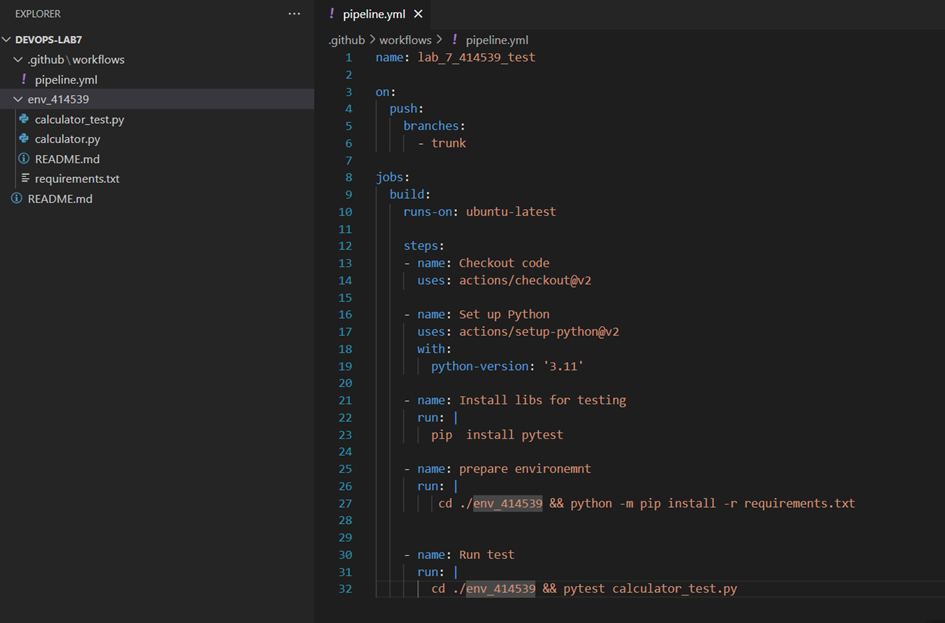
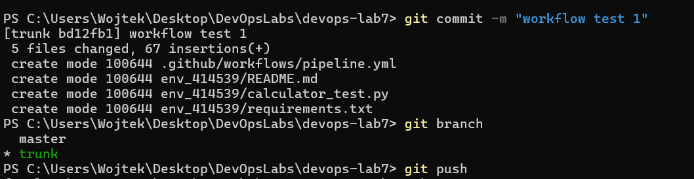
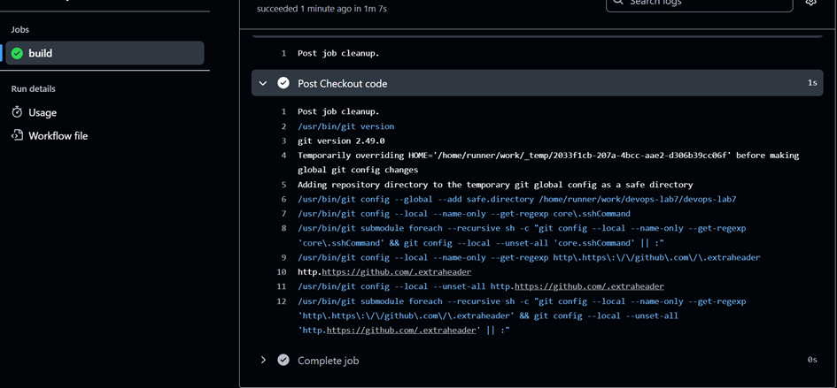
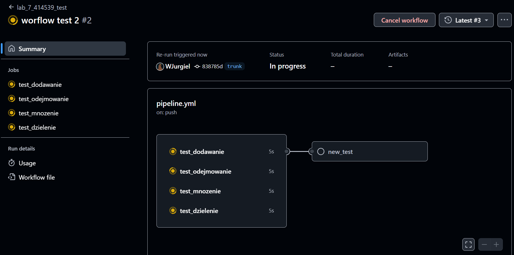
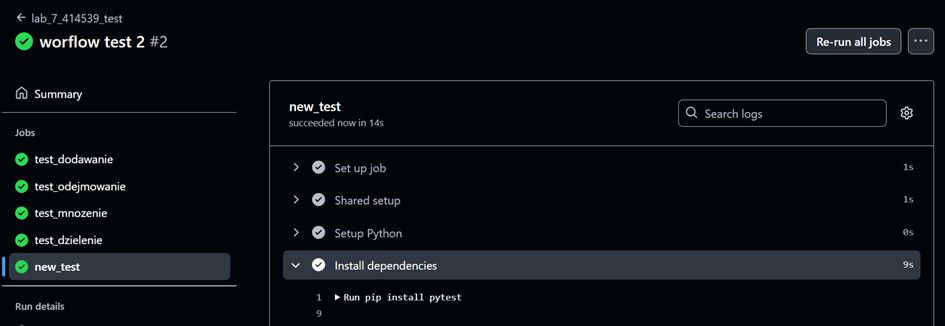

Lab 7 sprawozdanie

## Rozróżnienie dwóch oddzielnych repozytoriów
* dev_ops_lato_2025 -> główne repo laboratoriów
* devops-lab7 -> własne repozytorium


## Konfiguracja swojego repo
* umieszczenie pliku .yml w .github/workflows i naniesienie zmian w tym pliku 
 

## Sprawdzenie działania 
* commit & push

* job build uruchomił się i przeszedł


## Edycja plików .py
* stworzenie nowych funkcji w calculator.py
    ```python 
    def create_dataset(dataset):
        data = pd.DataFrame(dataset)
        return data

    def get_mean_price(data):
        if 'price' in data.columns: 
            return data.price.mean()
        return -1

    def get_blue_cars(data):
        if 'color' and 'cars' in data.columns:
            return data[data['color'] == 'blue'][['cars', 'price']]
        return -1

    def get_doors_count(data):
        return sum(data['doors'])
    ```
* stworzenie testów do tych funkcji
    ```python
    dataset = {
        'cars': ['Audi', 'BMW', 'Peugeot', 'Ford'],
        'color': ['red', 'black', 'blue', 'blue'],
        'doors': [5,3,5,5],
        'price': [6000,4500, 3000, 6500]
    }

    def test_create_dataset():
        data = create_dataset(dataset)
        assert data.shape == (4,4)
        assert data.size == 16

    def test_get_mean_price():
        data = create_dataset(dataset)
        mean = get_mean_price(data)
        assert mean != -1
        assert mean == 5000

    def test_get_blue_cars():
        data = create_dataset(dataset)
        expected = pd.DataFrame({
            'cars': ['Peugeot', 'Ford'],
            'price': [3000, 6500]
        })
        result = get_blue_cars(data)
        assert result.reset_index(drop=True).equals(expected.reset_index(drop=True))

    def test_get_doors_count():
        data = create_dataset(dataset)
        assert get_doors_count(data) == 18
    ```
* update requirements.txt
    ```txt
    numpy
    pandas
    ```
## Edycja pliku pipeline.yml
* stworzenie równoległych jobów (pokazane tylko test_dodawanie i test_odejmowanie)
    ```yml
    jobs:
  test_dodawanie:
    runs-on: ubuntu-latest
    steps:
      - name: Shared setup
        uses: actions/checkout@v2
      - name: Setup Python
        uses: actions/setup-python@v2
        with:
          python-version: '3.11'
      - name: Install dependencies
        run: |
          pip install pytest
          cd ./env_414539
          python -m pip install -r requirements.txt
      - name: Run test_dodawanie
        run: |
          cd ./env_414539
          pytest calculator_test.py -k "test_dodawanie"

  test_odejmowanie:
    runs-on: ubuntu-latest
    steps:
      - name: Shared setup
        uses: actions/checkout@v2
      - name: Setup Python
        uses: actions/setup-python@v2
        with:
          python-version: '3.11'
      - name: Install dependencies
        run: |
          pip install pytest
          cd ./env_414539
          python -m pip install -r requirements.txt
      - name: Run test_odejmowanie
        run: |
          cd ./env_414539
          pytest calculator_test.py -k "test_odejmowanie"
    ```
* stworzenie jobu uruchamiającego nowe testy po pozytywnym wykonaniu się poprzednich 
    ```yml
    new_test:
        needs: [test_dodawanie, test_odejmowanie, test_mnozenie, test_dzielenie]
        runs-on: ubuntu-latest
        steps:
        - name: Shared setup
            uses: actions/checkout@v2
        - name: Setup Python
            uses: actions/setup-python@v2
            with:
            python-version: '3.11'
        - name: Install dependencies
            run: |
            pip install pytest
            cd ./env_414539
            python -m pip install -r requirements.txt
        - name: Run new tests
            run: |
            cd ./env_414539
            pytest calculator_test.py -k "test_create_dataset or test_get_mean_price or test_get_blue_cars or test_get_doors_count"
## weryfikacja testów 
* testy **test_\*** uruchamiają się w tym samym czasie (tworzą własne środowiska wykonawcze)
* po poprawnym wykonaniu powyższych testów, uruchamia się job z nowymi testami

